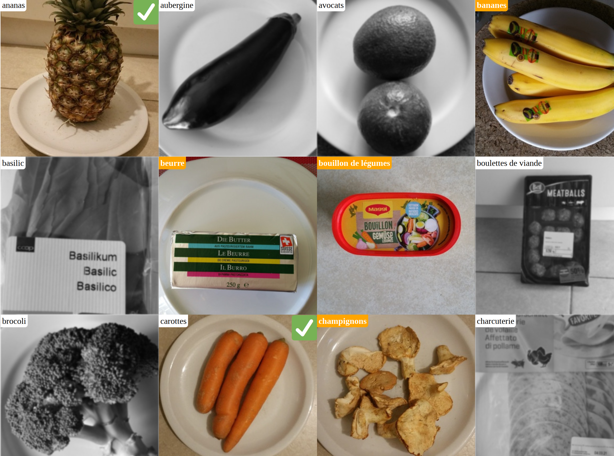

# Self-Hosted Shared Shopping List



## Build

```shell
cd shopping-quarkus
./gradlew build --native
```

The executable gets saved to `shopping-quarkus/build/shopping-quarkus-1.0.0-SNAPSHOT-runner`.

## Setup

1. Run the program to create the database schema
2. Take photos of things you commonly need to buy
3. Crop and resize them to get square pictures (I use 300x300 pixels)
4. Give a name to all your pictures with the `ProductPicture` table.
5. Insert all your shopping items into the `Item` table:
   * put `UNUSED` into `state`,
   * `1` into `sequence`,
   * the `text` of the `ProductPicture` you want to use for that item.

## Usage

1. At home, open http://localhost:4570/SELECT.
You should see all your photos, greyed out.
2. Click/touch all the items you need to buy. They should become colourful.
3. Go to the market, open http://localhost:4570/SHOP. You should only see the items that you selected in step 2.
4. Whenever you buy one item, touch it. A green checkmark should appear

I recommend you deploy it somewhere you can access it from multiple locations! Then,
* someone who stayed at home can add stuff to the shopping list while you shop. 
* Many people in the household can open the `SELECT` page to select things they need.
* Many people can open the `SHOP` page while they shop to optimise the shopping and make sure nothing is forgotten, nothing is taken twice!
